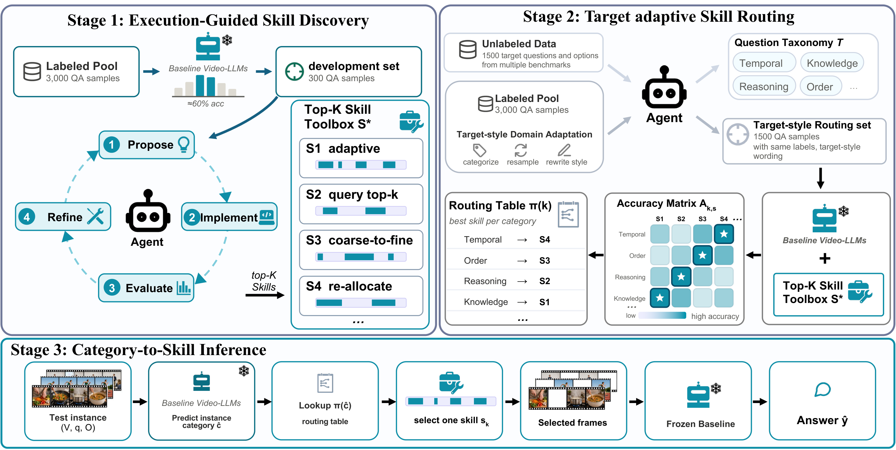

# 🔥 AutoSkill: One Skill Does Not Fit All

Code release for the paper:

[**One Skill Does Not Fit All: Automatic Discovery and Taxonomy-Guided Routing of Frame-Selection Skills for Long-Video Question Answering**](https://arxiv.org/abs/2609.12517)

[Jian Hu*](https://lwpyh.github.io/), Zixu Cheng*, Da Li, Wei Li, Ziquan Liu, [Shaogang Gong](http://www.eecs.qmul.ac.uk/~sgg/)

<sup>* Equal contribution.</sup>

<p>
<a href="https://arxiv.org/abs/2609.12517"></a>
<a href="https://lwpyh.github.io/autoskill_pipeline/"></a>
</p>

## 🚀 News

- **[2026.09]** AutoSkill code and development data are publicly released.
- **[2026.09.11]** Our paper is available on [arXiv](https://arxiv.org/abs/2609.12517).

<p align="center">
  
</p>

## 💡 Highlight

Long-video question answering is **not one homogeneous frame-retrieval problem**.

Different questions require different forms of visual evidence: counting may benefit from broad and diverse coverage, temporal reasoning from localized co-occurring evidence, OCR questions from text-aware sampling, while narrative understanding may require global temporal coverage. Consequently, **no single frame-selection policy is optimal for every question category or benchmark**.

**AutoSkill** treats frame selection as an **evidence-acquisition policy** and replaces the conventional one-selector-for-all paradigm with an automatically discovered and adaptively routed skill toolbox.

The key idea is simple:

> **Discover multiple complementary frame-selection skills, learn when each skill should be used, and execute only one skill for each question.**

AutoSkill has three key properties:

- **Automatic Skill Discovery.**  
  An LLM agent iteratively diagnoses failures, proposes frame-selection strategies, implements executable skills, evaluates them with a frozen Video-MLLM, and refines the toolbox using execution feedback.

- **Target-Adaptive Taxonomy-Guided Routing.**  
  AutoSkill uses only **unlabelled target questions and answer options** to induce a shared semantic taxonomy and adapt labelled source examples into the target query style. No target videos or target answers are used to construct the router.

- **One Skill, One Video-MLLM Pass.**  
  At inference time, each question is assigned to one semantic category and routed to exactly one frame-selection skill. The selected frames are then processed by the frozen Video-MLLM in a single inference pass.

AutoSkill is therefore **source-supervised, training-free, and target-label-free**: it does not update the Video-MLLM or auxiliary models, and target adaptation never accesses paired target videos or answer annotations.

---

## 🧠 How AutoSkill Works

### Stage 1: Execution-Guided Skill Discovery

Starting from a capability-focused development set, an LLM agent repeatedly performs

```text
Failure Diagnosis
      ↓
Skill Proposal
      ↓
Implementation
      ↓
Reviewer Check
      ↓
CPU Smoke Test
      ↓
GPU Evaluation
      ↓
Performance Analysis
      └──────────────→ next cycle
```

The complete discovery procedure is specified in [`SKILL.md`](SKILL.md).

After multiple feedback cycles, the best-performing complementary skills form the final **Top-K skill toolbox**.

For Qwen2.5-VL-7B, the discovered Top-5 toolbox contains:

| Paper Name | Implementation | Main Intuition |
|---|---|---|
| **SigLIP-MMR** | `siglip_mmr_diverse` | Query relevance + diverse visual evidence |
| **CLIP-Spatial** | `clip_spatial_cooccur` | Spatially co-occurring evidence |
| **CLIP-Count** | `clip_count_topk` | Count-sensitive frame retrieval |
| **CLIP-MMR** | `clip_mmr_diverse` | CLIP relevance + diversity |
| **SigLIP-OCR** | `siglip_ocr_text_aware` | Text-aware visual evidence |
| Uniform Sampling | `uniform_128_direct` | 128-frame baseline |

---

### Stage 2: Target-Adaptive Skill Routing

AutoSkill adapts the discovered toolbox to the target query distribution **without target annotations**.

We collect unlabelled question-option pairs from the target benchmarks and induce a shared taxonomy of **19 semantic question categories**.

For each category, semantically compatible labelled source samples are rewritten into the target query style while preserving the original video grounding and answer labels.

The discovered skills are evaluated on this target-style routing set to estimate a category-specific skill utility matrix:

```text
                Skill 1   Skill 2   Skill 3   ...   Skill K
Category 1         ✓         ·         ·              ·
Category 2         ·         ✓         ·              ·
Category 3         ·         ·         ✓              ·
   ...
```

The best skill for each category forms the final category-to-skill routing table.

<details>
<summary><b>19 Question Categories</b></summary>

<br>

`action_recognition`, `anomaly_detection`, `appearance`, `causal_reasoning`,
`counting`, `emotion_state`, `event_identification`, `fact_verification`,
`general_qa`, `narrative_plot`, `negative_qa`, `object_identification`,
`ocr_text`, `other`, `person_attribute`, `spatial_location`,
`temporal_ordering`, `timestamp_specific`, `yes_no`

</details>

---

### Stage 3: Category-to-Skill Inference

For each test question:

```text
Question
   ↓
Semantic Category Prediction
   ↓
Category → Skill Lookup
   ↓
Execute ONE Frame-Selection Skill
   ↓
Selected Frames
   ↓
Frozen Video-MLLM
   ↓
Answer
```

Only one routed skill is executed for each sample, preserving approximately the inference cost of a conventional single-skill method.

---

## 📊 Results

We evaluate AutoSkill on five long-video benchmark splits:

- MLVU-dev
- MLVU-test
- LongVideoBench
- VideoMME
- LVBench

All experiments use a unified **128-frame budget** unless otherwise specified.

### Qwen2.5-VL-7B

| Method | MLVU-dev | MLVU-test | LongVideoBench | VideoMME | LVBench | Average |
|---|---:|---:|---:|---:|---:|---:|
| Uniform Sampling | 66.0 | 47.7 | 61.2 | 64.6 | 42.5 | 56.4 |
| SigLIP-MMR | 68.3 | **51.5** | 61.6 | **65.3** | 46.2 | 58.6 |
| **AutoSkill** | **69.0** | 51.1 | **61.9** | 65.2 | **46.8** | **58.8** |
| **Gain over baseline** | **+3.0** | **+3.4** | **+0.7** | **+0.6** | **+4.3** | **+2.4** |

AutoSkill achieves the best overall performance while using only a single routed skill for each question.

### Cross-Backbone Generalization

| Backbone | Uniform Baseline | Best Discovered Fixed Skill | AutoSkill | Gain |
|---|---:|---:|---:|---:|
| Qwen2.5-VL-7B | 56.4 | 58.6 | **58.8** | **+2.4** |
| Qwen3.5-4B | 59.2 | 60.0 | **60.4** | **+1.2** |

The toolbox is rediscovered independently for each backbone, showing that AutoSkill adapts the skill-discovery and routing procedure rather than relying on one manually fixed set of heuristics.

---

## 🔀 Why Routing Instead of One Global Skill?

AutoSkill's improvement does not come only from finding a stronger frame selector.

| Strategy | Target Labels | Avg. Accuracy | Video-MLLM Passes |
|---|---:|---:|---:|
| Uniform Sampling | ✗ | 56.4 | 1 |
| Discovery-Cycle Router | ✗ | 57.4 | 1 |
| Target-Adapted Global Fixed | ✗ | 57.9 | 1 |
| Majority Voting | ✗ | 58.6 | 5 |
| Post-hoc Best Fixed Skill | ✓ | 58.6 | 1 |
| **AutoSkill** | **✗** | **58.8** | **1** |
| Optimal Category Mapping | ✓ | 60.4 | 1 |

Compared with the target-adapted global fixed strategy, category-specific routing provides a further **+0.9 point** improvement under the same supervision and inference budget.

Majority voting reaches 58.6 but requires **five Video-MLLM passes** per sample, whereas AutoSkill achieves 58.8 with only **one pass**.

---

## 📦 Data

The development data used for AutoSkill's skill-discovery loop is released on Hugging Face:

🤗 **[Cade921/AutoSkill_dev](https://huggingface.co/datasets/Cade921/AutoSkill_dev)**

| File | # Samples | Description |
|---|---:|---|
| `dev300.json` | 300 | Capability-focused development set used throughout skill discovery |
| `pool3000.json` | 3,000 | Larger labelled source pool |

`dev300.json` is stratified across short-, medium-, and long-duration videos and is designed to provide informative success/failure feedback for skill discovery.

No video files are redistributed. Each example points to its original video through metadata such as `data_source` and `video_relpath`.

Please refer to the Hugging Face dataset card for source-specific licenses and attribution.

---

## ⚙️ Installation

### Requirements

- Python 3.10+
- PyTorch 2.0+
- `transformers`
- `decord`
- Qwen2.5-VL / Qwen3.5 model weights
- [`lmms-eval`](https://github.com/EvolvingLMMs-Lab/lmms-eval)

Clone this repository:

```bash
git clone https://github.com/lwpyh/autoskill_pipeline.git
cd autoskill_pipeline
```

Configure the model and data paths according to your environment.

---

## 🚀 Quick Start

### Run the Full Pipeline

```bash
# Model
export MODEL_PATH=/path/to/Qwen2.5-VL-7B-Instruct

# Benchmark outputs
export BENCH_DIR=/path/to/benchmark_results

# Skill-discovery results
export N1800_RESULTS=/path/to/N1800_results.json
export SUPP_RESULTS=/path/to/supplement_results.json
export N1800_META=/path/to/n1800_metadata.json
export SUPP_META=/path/to/supp_metadata.json

# Routing data
export TRAIN_JSON=/path/to/train_samples.json
export BENCH_QUERIES=/path/to/benchmark_queries.json

bash run_pipeline.sh
```

You can also run only selected stages:

```bash
# Build router only
bash run_pipeline.sh --stage 3

# Router → benchmark classification → evaluation
bash run_pipeline.sh --stages 3,4,5
```

---

<details>
<summary><b>Run Each Stage Separately</b></summary>

### 1. Select the Top-5 Discovered Skills

```bash
python stage1_skill_discovery.py \
    --n1800-results $N1800_RESULTS \
    --supp-results $SUPP_RESULTS \
    --n1800-meta $N1800_META \
    --supp-meta $SUPP_META \
    --output outputs/top5_skills.json
```

The complete iterative discovery process that generates candidate skills is documented in [`SKILL.md`](SKILL.md).

### 2. Construct the Target-Style Routing Set

```bash
python stage2_rewrite_trainset.py \
    --train-json $TRAIN_JSON \
    --bench-queries $BENCH_QUERIES \
    --model-path $MODEL_PATH \
    --output outputs/train_rewritten.json
```

### 3. Build the Category-to-Skill Router

```bash
python stage3_build_router.py \
    --train-samples outputs/train_rewritten.json \
    --top5-skills outputs/top5_skills.json \
    --output outputs/router_table.json
```

### 4. Classify Benchmark Questions

```bash
python stage4_classify_benchmark.py \
    --bench-dir $BENCH_DIR \
    --skills "siglip_mmr_diverse,clip_spatial_cooccur,clip_count_topk,siglip_ocr_text_aware,clip_mmr_diverse,uniform_128_direct" \
    --model-path $MODEL_PATH \
    --output outputs/cls_pred_v3.json
```

### 5. Route and Evaluate

```bash
python stage5_evaluate.py \
    --bench-dir $BENCH_DIR \
    --skills "siglip_mmr_diverse,clip_spatial_cooccur,clip_count_topk,siglip_ocr_text_aware,clip_mmr_diverse,uniform_128_direct" \
    --router-table outputs/router_table.json \
    --cls-pred outputs/cls_pred_v3.json
```

</details>

---

## 📁 Repository Structure

```text
autoskill_pipeline/
├── README.md
├── SKILL.md
├── run_pipeline.sh
│
├── stage1_skill_discovery.py
├── stage2_rewrite_trainset.py
├── stage3_build_router.py
├── stage4_classify_benchmark.py
├── stage5_evaluate.py
│
├── skills/
│   └── skills.py
│
├── lmms_eval_model/
│   └── qwen2_5_vl_skill.py
│
├── scripts/
│   ├── run_benchmark_skill.sh
│   └── run_all_skills.sh
│
├── data/
│   ├── top5_skills.json
│   ├── router_table.json
│   └── aligned_samples.jsonl
│
└── docs/
    └── static/
        └── images/
            └── teaser.png
```

---

## 📖 Citation

If you find AutoSkill useful in your research, please consider citing our paper:

```bibtex
@misc{hu2026oneskill,
  title        = {One Skill Does Not Fit All: Automatic Discovery and Taxonomy-Guided Routing of Frame-Selection Skills for Long-Video Question Answering},
  author       = {Hu, Jian and Cheng, Zixu and Li, Da and Li, Wei and Liu, Ziquan and Gong, Shaogang},
  year         = {2026},
  eprint       = {2609.12517},
  archivePrefix= {arXiv},
  primaryClass = {cs.CV},
  url          = {https://arxiv.org/abs/2609.12517}
}
```

---

## 💖 Acknowledgements

We thank the authors and maintainers of the open-source models, benchmarks, and evaluation frameworks that make this work possible, including:

- [Qwen2.5-VL](https://github.com/QwenLM/Qwen2.5-VL)
- [lmms-eval](https://github.com/EvolvingLMMs-Lab/lmms-eval)
- CLIP
- SigLIP
- DINOv2
- Grounding DINO
- MLVU
- LongVideoBench
- VideoMME
- LVBench
